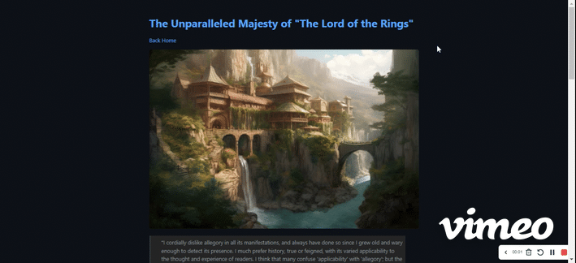

# Static Site Generator

## Overview

This project is a static site generator written in Python. It takes Markdown content and converts it into HTML, copying static assets and applying templates to create a fully functional static website.

## Installation

Install python on your system following this links:
[Python Windows](https://python.org/downloads/windows/)
or
[Python Linux](https://python.org/downloads/source/)

In your shell run:

```bash
sudo apt install python3
```

## Usage

### Setting Up Your Project

1. **Static Assets**: Place your static assets (e.g., images, CSS files) in the `static/` directory.
2. **Markdown Content**: Place your Markdown content files in the `content/` directory.

### Running the Generator and Serving the Site

To build the static site and serve it locally, follow these steps:

### Running the Generator and Serving the Site

To build the static site and serve it locally, follow these steps:

1.  **Run the Main Script**:
    This script will:
        ```bash
        ./main.sh

        ```

        - Convert the Markdown files in `content/` to HTML. This is done recursively. Place your markdown files in subdirectories of `/content`
        For example: `/content/majesty` will create a page named majesty
        - Copy the static assets from `static/` to `public/`.
        - Apply the HTML templates.
        - Serve the generated site from the `public/` directory.

## Directory and File Descriptions

- **content/**: Directory containing Markdown content files.
- **main.sh**: Shell script that runs the generator and serves the site.
- **public/**: Directory where generated HTML and copied static assets are stored.
- **README.md**: This documentation file.
- **requirements.txt**: Lists the Python dependencies needed for the project.
- **server.py**: Script to run a local development server for previewing the generated site (invoked by `main.sh`).
- **src/**: Contains the core logic and modules of the static site generator.
  - `copy_static.py`: Script to copy static files to the `public/` directory.
  - `generate.py`: Script to convert Markdown content into HTML.
  - `htmlnode.py`, `inline_markdown.py`, `markdown_blocks.py`, `textnode.py`: Modules for handling different aspects of Markdown to HTML conversion.
  - `main.py`: Main entry point for the generator logic.
  - `test_htmlnode.py`, `test_inline_markdown.py`, `test_markdown_blocks.py`, `test_textnode.py`: Test scripts for the respective modules.
- **static/**: Directory containing static assets to be included in the generated site.
  - `images/rivendell.png`: Example image.
  - `index.css`: Stylesheet.
- **template.html**: HTML template file used to wrap the generated content.
- **tests.sh**: Shell script for running the test suite.

## License

This project is licensed under the MIT License. See the `LICENSE` file for details.

## Acknowledgments

This project is part of a course from [Boot.dev](https://boot.dev/).

---

## Examples



````markdown
# The Unparalleled Majesty of "The Lord of the Rings"

[Back Home](/)


> "I cordially dislike allegory in all its manifestations, and always have done so since I grew old and wary enough to detect its presence.
> I much prefer history, true or feigned, with its varied applicability to the thought and experience of readers.
> I think that many confuse 'applicability' with 'allegory'; but the one resides in the freedom of the reader, and the other in the purposed domination of the author."

In the annals of fantasy literature and the broader realm of creative world-building, few sagas can rival the intricate tapestry woven by J.R.R. Tolkien in _The Lord of the Rings_. You can find the [wiki here](https://lotr.fandom.com/wiki/Main_Page).

## Introduction

This series, a cornerstone of what I, in my many years as an **Archmage**, have come to recognize as the pinnacle of imaginative creation, stands unrivaled in its depth, complexity, and the sheer scope of its _legendarium_. As we embark on this exploration, let us delve into the reasons why this monumental work is celebrated as the finest in the world.

## A Rich Tapestry of Lore

One cannot simply discuss _The Lord of the Rings_ without acknowledging the bedrock upon which it stands: **The Silmarillion**. This compendium of mythopoeic tales sets the stage for Middle-earth's history, from the creation myth of Eä to the epic sagas of the Elder Days. It is a testament to Tolkien's unparalleled skill as a linguist and myth-maker, crafting:

1. An elaborate pantheon of deities (the `Valar` and `Maiar`)
2. The tragic saga of the Noldor Elves
3. The rise and fall of great kingdoms such as Gondolin and Númenor

   ```python
   print("Lord")
   print("of")
   print("the")
   print("Rings")
   ```

## The Art of **World-Building**

### Crafting Middle-earth

Tolkien's Middle-earth is a realm of breathtaking diversity and realism, brought to life by his meticulous attention to detail. This world is characterized by:

- **Diverse Cultures and Languages**: Each race, from the noble Elves to the sturdy Dwarves, is endowed with its own rich history, customs, and language. Tolkien, leveraging his expertise in philology, constructed languages such as Quenya and Sindarin, each with its own grammar and lexicon.
- **Geographical Realism**: The landscape of Middle-earth, from the Shire's pastoral hills to the shadowy depths of Mordor, is depicted with such vividness that it feels as tangible as our own world.
- **Historical Depth**: The legendarium is imbued with a sense of history, with ruins, artifacts, and lore that hint at bygone eras, giving the world a lived-in, authentic feel.

## Themes of _Timeless_ Relevance

### The _Struggle_ of Good vs. Evil

At its heart, _The Lord of the Rings_ is a timeless narrative of the perennial struggle between light and darkness, a theme that resonates deeply with the human experience. The saga explores:

- The resilience of the human (and hobbit) spirit in the face of overwhelming odds
- The corrupting influence of power, epitomized by the One Ring
- The importance of friendship, loyalty, and sacrifice

These universal themes lend the series a profound philosophical depth, making it a beacon of wisdom and insight for generations of readers.

## A Legacy **Unmatched**

### The Influence on Modern Fantasy

The shadow that _The Lord of the Rings_ casts over the fantasy genre is both vast and deep, having inspired countless authors, artists, and filmmakers. Its legacy is evident in:

- The archetypal "hero's journey" that has become a staple of fantasy narratives
- The trope of the "fellowship," a diverse group banding together to face a common foe
- The concept of a richly detailed fantasy world, which has become a benchmark for the genre

## Conclusion

As we stand at the threshold of this mystical realm, it is clear that _The Lord of the Rings_ is not merely a series but a gateway to a world that continues to enchant and inspire. It is a beacon of imagination, a wellspring of wisdom, and a testament to the power of myth. In the grand tapestry of fantasy literature, Tolkien's masterpiece is the gleaming jewel in the crown, unmatched in its majesty and enduring in its legacy. As an Archmage who has traversed the myriad realms of magic and lore, I declare with utmost conviction: _The Lord of the Rings_ reigns supreme as the greatest legendarium our world has ever known.

Splendid! Then we have an accord: in the realm of fantasy and beyond, Tolkien's creation is unparalleled, a treasure trove of wisdom, wonder, and the indomitable spirit of adventure that dwells within us all.
````
